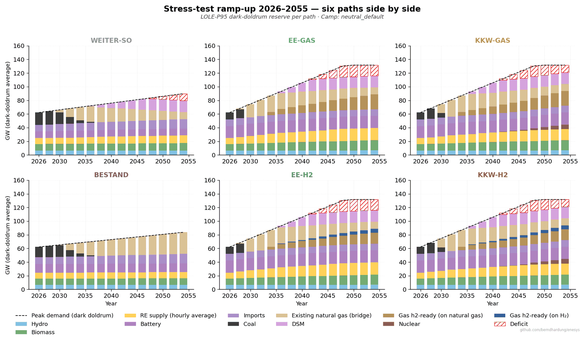

# enesys — Forward-cost analysis of Germany's energy transition

> **⚠️ Pre-1.0 development release.** API surface may still change
> before 1.0. Code and analyses are functional and tested. Pin to a
> specific Git tag if you rely on reproducible results. See
> [`CHANGELOG.md`](CHANGELOG.md) for the current cut. Issues and PRs
> welcome.

> Six paths, three decades, one open model. Every assumption
> documented, every source cited, every claim reproducible in five
> minutes.

[](https://opensource.org/licenses/MIT)
[](https://www.python.org/downloads/)
[](https://colab.research.google.com/github/berndhardung/enesys/blob/main/notebooks/01_quickstart.ipynb)



*Each panel shows one path's capacity build-up over 2026–2055 against
the dark-doldrum peak-demand line (LOLE-P95 reserve standard).
Red-hatched zones mark residual demand the backup architecture cannot
cover. Reproduce: `python examples/generate_chart_stress_rampup.py`.*

**The German energy debate argues about the wrong axis.** Most
discussions ask: renewable or nuclear? But the actual decision is
two-dimensional — base-load × backup. This repository contains the
quantitative model that walks through both axes for six realistic
paths from 2026 to 2055, then asks: which path wins under *any*
plausible set of assumptions?

| Want to … | Then look at … |
|-----------|----------------|
| **Try the interactive app** | [Live demo on Streamlit Community Cloud](https://enesys.streamlit.app) — anchor camp left, variant camp right, six charts side by side |
| **Try the model without installing anything** | [Open the Quickstart notebook in Colab](https://colab.research.google.com/github/berndhardung/enesys/blob/main/notebooks/01_quickstart.ipynb) — 5 minutes, no setup |
| **Use the model programmatically** | [Quickstart §](#use-the-model-programmatically) — six lines of Python |
| **Audit the assumptions** | [`docs/SOURCES.md`](docs/SOURCES.md) — every default with primary-source tag |
| **See the formulas** | [`docs/FORMULAS.md`](docs/FORMULAS.md) — derivation and worked examples |
| **Challenge a finding** | Open an issue with model parameters and your counter-evidence |

## What this is

A Python model that compares **six pathways** for the German energy transition,
arranged along two independent axes (base-load × backup):

|              | **Backup: Gas**  | **Backup: H₂** |
|--------------|------------------|----------------|
| **Status quo / inaction**   | WEITER-SO    | (n/a)          |
| **Existing-fleet emphasis** | BESTAND      | (n/a)          |
| **EE-only**      | EE-GAS       | EE-H2          |
| **EE + KKW**     | KKW-GAS      | KKW-H2         |

The model has explicit treatment of:

- **Forward costs** (no sunk costs in investment decisions)
- **Time-path dynamics** (2026 → 2055, with realistic build-times)
- **Asymmetric uncertainty** (different assumption-sets for renewables vs.
  nuclear advocates)
- **Sector coupling efficiency** (heat pumps and EVs as 2:1 primary energy
  multipliers)
- **Grid stability requirements** (inertia, black-start, frequency control)
- **Winter dunkelflaute stress test** (10-day cold dark calm periods)

The model traces every default parameter to a primary source (see
[`docs/SOURCES.md`](docs/SOURCES.md)) and exposes every
formula transparently (see [`docs/FORMULAS.md`](docs/FORMULAS.md)).

## Why another OSS energy model?

The German energy-modelling landscape is rich — PyPSA-Eur, REMIND,
MESSAGE, oemof, AnyMOD, calliope, Agora and Fraunhofer studies, IEA
scenarios. This model is *not* a replacement for any of them; it has a
much narrower lens, focused on one question: **which path is robustly
cheapest as a forward decision, across the assumption substrates the
opposing camps would actually defend?**

### What this is not

- **Not a high-resolution dispatch model.** No hourly grid simulation,
  no unit-commitment, no network flows. For that:
  [PyPSA-Eur](https://github.com/PyPSA/pypsa-eur),
  [oemof](https://oemof.org/), [calliope](https://www.callio.pe/).
- **Not an integrated assessment / macro-economy model.** No CGE
  feedback loops, no inter-sectoral capital allocation, no global
  emissions pathways. For that:
  [REMIND](https://www.pik-potsdam.de/en/institute/departments/transformation-pathways/models/remind),
  [MESSAGE](https://iiasa.ac.at/models-tools-data/message),
  [IEA ETP](https://www.iea.org/reports/energy-technology-perspectives-2024).
- **Not a policy roadmap or a strategy paper.** For sector-coupling
  pathways with policy detail:
  [Agora Energiewende](https://www.agora-energiewende.org/),
  [Fraunhofer ISE studies](https://www.ise.fraunhofer.de/en/publications/studies.html),
  [BMBF-Ariadne project](https://ariadneprojekt.de/).
- **Not a forecast.** The model answers "given these assumptions, what
  follows?" — not "what will Germany do?".

If your question fits one of the categories above, those tools are the
right starting point. The four properties below describe what this
model is doing inside its narrower lens.

## What makes this distinctive

Five properties — each verifiable in the code, not just claims. Full
discussion in [`docs/methodik/methodology.md`](docs/methodik/methodology.md).

1. **Forward-cost framing, sunk costs excluded by construction.** KKW
   decommissioning fund, EEG-Altlast, Endlager fund sit in dedicated
   context fields and never enter the LCOE arithmetic. Most policy
   discussions silently mix the two.
   ([`core/path_model.py`](src/enesys/core/path_model.py),
   [`core/path_inputs.py`](src/enesys/core/path_inputs.py))

2. **Two-dimensional path space (base-load × backup).** Six paths, not
   the usual one-axis "renewables vs nuclear" framing. KKW-GAS and
   KKW-H₂ exist as separate paths precisely because the backup vector
   is independent of the base-load source.

3. **Camp-symmetric defaults — no built-in bias.** Every contested
   parameter carries EE-/atom-/bestand-optimistic alternatives
   alongside the neutral default. In the point estimate each camp wins
   its preferred path (atom_optimistic → KKW-GAS, three others →
   EE-GAS). The recommendation (EE-GAS) follows from **min-max-regret
   across the four camps**, not from "EE wins everywhere".
   ([`core/camp_ranges.py`](src/enesys/core/camp_ranges.py),
   [`core/regret_decision_tree.py`](src/enesys/core/regret_decision_tree.py))

4. **Parameter-substrate robustness check.** Swap the entire enesys
   assumption substrate for the PyPSA-Tech-Data substrate that feeds
   PyPSA-DE / BMBF-Ariadne; structural path ordering survives. The
   name is deliberately not "cross-validation" — that term has a
   specific statistical meaning that does not apply here.
   ([`tests/consistency/test_ariadne_convergence.py`](tests/consistency/test_ariadne_convergence.py),
   [`docs/PARAM_SETS.md`](docs/PARAM_SETS.md))

5. **Nuclear start-year robustness check — regret is not a timing
   artifact.** `nuclear_start_year_regret_analysis` overrides the
   camp-derived KKW start years (2036/2046/2050) with a uniform value
   X across all camps. At default parameters,
   `kkw_regret_crossover_year((2020, 2055))` returns `None` — KKW
   max-regret stays ~3 ct/kWh above EE-GAS regardless of when nuclear
   first delivers. The recommendation survives the counterfactual
   where KKW arrives in 2028.
   ([`core/regret_decision_tree.py`](src/enesys/core/regret_decision_tree.py))

## The six paths

| Model | Strategy | Key feature |
|---|---|---|
| **WEITER-SO** | Status quo continuation | Baseline: political inaction, Kohle until 2038, Erdgas wachsend |
| **BESTAND** | Existing-fleet emphasis, dampened EE-Zubau | Shows what »keep what we have« actually costs |
| **EE-GAS** | Renewables + Storage + Gas-Backup with green ramp-up | Pragmatic optimum, robust to H₂ uncertainty |
| **EE-H2** | Renewables + Storage + H₂-Backup | Pure energy transition, H₂ wager |
| **KKW-GAS** | Renewables + Nuclear (post-2042) + Bridge-Gas | Nuclear renaissance with realistic build-times |
| **KKW-H2** | Renewables + Nuclear + H₂-Backup | Reveals structural independence of backup choice |

Headline finding (30-year average 2026-2055, `neutral_default` camp;
CO₂ on a **system boundary** — power-sector emissions plus external
sector-coupling emissions from heating and mobility that remain fossil
in WEITER-SO/BESTAND):

**Deterministic baseline** — the six paths at their neutral mid-point
assumptions:

| Path | Cost (LCOE) | Cumulative CO₂ (system boundary) | vs WEITER-SO |
|---|---|---|---|
| EE-GAS | 16.79 ct/kWh | 2,937 Mt | saves 1,495 Mt (−34 %) |
| WEITER-SO | 16.97 ct/kWh | 4,432 Mt | (baseline) |
| EE-H2 | 17.26 ct/kWh | **2,689 Mt** | saves 1,743 Mt (−39 %) |
| BESTAND | 17.33 ct/kWh | 4,870 Mt | adds 438 Mt |
| KKW-GAS | 17.57 ct/kWh | 3,312 Mt | saves 1,120 Mt (−25 %) |
| KKW-H2 | 17.82 ct/kWh | 3,022 Mt | saves 1,410 Mt (−32 %) |

**Reading this table requires care.** The cost spread across the six
paths is 1.03 ct/kWh — *smaller* than the Monte-Carlo P5-P95 spread
within any single path (1.7-3.6 ct/kWh across 2,000 runs sampling
uniformly over the camp ranges). Reading off ranks 1-3 from the cost
column is reading noise. The robust claims sit elsewhere.

**Cost robustness — Monte-Carlo, n = 2,000 over camp ranges:**

| Pair comparison | P(left cheaper than right) |
|---|---|
| EE-GAS vs KKW-GAS | **100 %** |
| EE-GAS vs KKW-H2 | **100 %** |
| EE-GAS vs EE-H2 | **97 %** |
| EE-GAS vs BESTAND | 53 % (coin flip) |
| EE-GAS vs WEITER-SO | 24 % (WEITER-SO cheaper in 76 % of runs) |

What survives the noise:

1. **Among the four active programmatic paths (EE-GAS, EE-H2, KKW-GAS,
   KKW-H2), EE-GAS is the robust cost choice.** Every other active path
   is more expensive in ≥ 97 % of runs; nuclear paths sit at the bottom
   of the cost distribution with certainty.
2. **The CO₂ separation is structural, not parameter-driven.** Active
   paths emit ~1,500-2,200 Mt less cumulative CO₂ than WEITER-SO/BESTAND
   over 30 years — the gap follows from fossil heating + mobility staying
   in WEITER-SO/BESTAND vs. being electrified in the active paths, not
   from cost assumptions. A power-sector-only CO₂ view would understate
   WEITER-SO and BESTAND by roughly a factor of two (their external
   emissions live in `r.co2_external_mt_per_year`, which the
   system-boundary total aggregates). KKW paths also emit *more*
   system-boundary CO₂ than their EE counterparts within the 30-year
   window (KKW-GAS 3,312 vs EE-GAS 2,937 Mt) — bridge-phase fossil
   coverage outweighs later operational gains.

What does *not* survive the noise — and is therefore stated honestly
as a tied cluster, not a ranking:

- The cost ordering between WEITER-SO, EE-GAS, BESTAND and EE-H2 sits
  inside Monte-Carlo overlap. The cost-only race between WEITER-SO and
  EE-GAS is a 76/24 split, not a 0.18-ct/kWh "near tie" — that's the
  "humility thesis" quantified sharply: **on cost alone, political
  inaction is the most likely winner; the case against WEITER-SO is the
  +1,495 Mt CO₂, not the price tag**.

**Other camps yield other deterministic top paths** (see distinctive
property 3 above); the recommendation comes from min-max-regret across
camps, not from any single deterministic table.

Numbers reproducible with `python -c "from enesys import compute_path; ..."`
and `python -c "from enesys import monte_carlo_all_paths; ..."` (see
Quickstart below).

## Quickstart

**Zero-setup path — Google Colab.** Open
[`notebooks/01_quickstart.ipynb`](notebooks/01_quickstart.ipynb) in
[Colab](https://colab.research.google.com/github/berndhardung/enesys/blob/main/notebooks/01_quickstart.ipynb)
and run all cells. The first cell `%pip install`s enesys from this repo;
the rest walks through the forward-cost snapshot, the four-camp lager-
symmetry, the 30-year trajectory, the tornado sensitivity, and a small
Monte-Carlo — five minutes end-to-end.

**Local install:**

```bash
git clone https://github.com/berndhardung/enesys.git
cd enesys
pip install -e .
```

**Easiest setup — VS Code + Docker (no Python on the host needed):** after `git clone` open the folder in VS Code (`code .`) and accept the "Reopen in Container" prompt. The included `.devcontainer/` provisions Python 3.12, uv, all dependencies and editor extensions; the venv is built during the container build so the environment is ready as soon as VS Code attaches.

**Bare-metal setup with uv:** install [uv](https://github.com/astral-sh/uv) once, then `make venv` builds the full dev environment deterministically from `uv.lock` in a few seconds.

```bash
curl -LsSf https://astral.sh/uv/install.sh | sh   # one-time, ~5 s
make venv                                          # ~5 s, uses uv.lock
```

**Or in GitHub Codespaces:** click *Code → Codespaces → Create codespace*. Same `.devcontainer/` setup, runs in the cloud.

### Run the interactive Streamlit app

The compare view (anchor camp ↔ variant camp, six core charts side by
side, sliders for any of 19 model parameters) ships as a Streamlit
app. The hosted demo lives at
[enesys.streamlit.app](https://enesys.streamlit.app); to run locally:

```bash
pip install -e .   # streamlit + matplotlib + pandas + plotly all included
streamlit run app/streamlit_app.py
```

Three pages reachable via the sidebar navigation:

- **🏠 Overview** — the headline finding (cost and CO₂ vs BESTAND),
  the structure of the six paths, the five camps explained.
- **📊 Charts** — pick an **anchor camp** on the left and a **variant
  camp** on the right; the six core charts render side by side.
  Slider overrides snap the variant to **Individuell** with the
  deviation shown in the caption above each chart. Deep-links: `?lang=de`/`en`,
  `?anchor=…`, `?variant=…`, `?mobile=1` for the portrait layout.
- **📚 Sources** — every default in the model is backed by a primary
  citation; slider tooltips deep-link to the matching tag.

### Use the model programmatically

```python
from enesys import compute_path, baseline_all_paths

# Forward-cost trajectory for the EE-GAS path, 2030-2055, in the
# neutral_default camp:
results = compute_path("ee_gas", years=[2030, 2040, 2050, 2055], camp="neutral_default")
for r in results:
    print(f"{r.year}: LCOE = {r.lcoe_ct_kwh:.2f} ct/kWh, CO2 = {r.co2_mt:.1f} Mt")

# Compare all six paths at one year:
prices = baseline_all_paths(year=2045, camp="neutral_default")
for path, lcoe in sorted(prices.items(), key=lambda x: x[1]):
    print(f"  {path:<10} {lcoe:6.2f} ct/kWh")
```

### Run the test suite

```bash
pytest tests/ -v
```

Covers path-model tests (Demand, Forward LCOE, 30-year integration,
six-path invariants, winter-stress test), sensitivity tests (tornado,
Monte-Carlo, camp presets), source-traceability tests, and convergence
tests against the external parameter substrate
(PyPSA-Technology-Data).

## Package layout

```
enesys/
├── README.md, LICENSE, CHANGELOG.md, AUTHORS.md, CONTRIBUTING.md, CODE_OF_CONDUCT.md
├── pyproject.toml, uv.lock, Makefile, VERSION
│
├── src/enesys/         Model library
│   ├── core/                         Data structures, path model, sensitivity, WACC
│   ├── extensions/                   land use, consumer, winter stress, profile costs
│   └── viz/                          Chart building blocks (matplotlib + plotly theme)
│
├── tests/                            pytest suite
└── docs/                             Methodology, formulas, sources, architecture
```

## Documentation map

- [`docs/QUICKSTART.md`](docs/QUICKSTART.md) — five-minute orientation
- [`docs/HOWTO_RUN.md`](docs/HOWTO_RUN.md) — running locally and in Docker
- [`docs/FORMULAS.md`](docs/FORMULAS.md) — every formula with derivation and
  worked examples
- [`docs/SOURCES.md`](docs/SOURCES.md) — every default parameter with source,
  range, and camp-specific assumptions
- [`docs/VERSIONING.md`](docs/VERSIONING.md) — version scheme and how the
  version is pinned across model packages
- [`docs/methodik/modell_architektur.md`](docs/methodik/modell_architektur.md) —
  high-level architecture overview
- [`docs/methodik/`](docs/methodik/) — further methodology deep dives
  (steady-state parameter consistency, bridge phase parameters, English
  methodology overview)

## Sources

The model is calibrated against:

- **Fraunhofer ISE** — *Stromgestehungskosten erneuerbarer Energien 2024*
  ([PDF](https://www.ise.fraunhofer.de/content/dam/ise/de/documents/publications/studies/DE2024_ISE_Studie_Stromgestehungskosten_Erneuerbare_Energien.pdf))
- **BloombergNEF** — *Energy Storage Cost Survey 2025* (10 Dec 2025);
  *LCOE Report 2026* (18 Feb 2026)
- **EWI Köln** — Hydrogen storage requirements
- **Cour des Comptes (FR)** — Flamanville EPR audit (17 years, €23.7 bn)
- **EDF** — Hinkley Point C status reports
- **KENFO** — *Geschäftsbericht 2024*
- **KernD** — *Bewertung der Fraunhofer ISE Studie* (pro-nuclear critique)
- **Modo Energy** — *Inertia in Europe* (Nov 2025)
- **DE-TSOs** — Joint inertia procurement (22 Jan 2026)

Full traceability is in [`docs/SOURCES.md`](docs/SOURCES.md).

## Reproducibility commitments

- **Pinned dependencies** in `uv.lock` (76 packages with hashes)
- **Deterministic Monte-Carlo** with fixed seeds in tests
- **Python 3.10+** with explicit version constraints
- **CI on every commit** via GitHub Actions
- **All defaults annotated** with `[SRC: ...]` tags pointing to
  `docs/SOURCES.md`

If you can't reproduce a result, please open an issue with the parameter
set you used and the command you ran.

## Citation

If you use this model in academic or policy work, please cite:

```bibtex
@software{enesys_2026,
  author       = {Hardung, Bernd},
  title        = {enesys: A transparent cost-robustness analysis
                  for the German energy transition},
  year         = {2026},
  publisher    = {GitHub},
  url          = {https://github.com/berndhardung/enesys},
  note         = {See CITATION.cff for current version}
}
```

## Contributing

This project welcomes:

- **Bug reports** for incorrect formulas, source mismatches, or test failures
- **Source updates** when newer studies (BNEF, ISE, BNetzA) are published
- **Translations** of the model into other regulatory contexts (FR, PL, etc.)
- **Critical reviews** of methodology — issues that say "your assumption X
  is wrong because Y" are especially welcome

What this project does **not** want:

- Pull requests that hardcode advocacy positions (pro/anti renewables, pro/anti
  nuclear) — the model must remain neutral and parameter-driven
- Deletion of "inconvenient" parameters or sources

See [`CONTRIBUTING.md`](CONTRIBUTING.md) for details.

## License

Source code (`src/`, `tests/`, top-level configuration) is licensed
under the **MIT License** — see [`LICENSE`](LICENSE).

Methodology documentation under `docs/` is distributed under MIT alongside
the source code; a separate license tier (CC0 or CC-BY-4.0) may be applied
at a later date.

