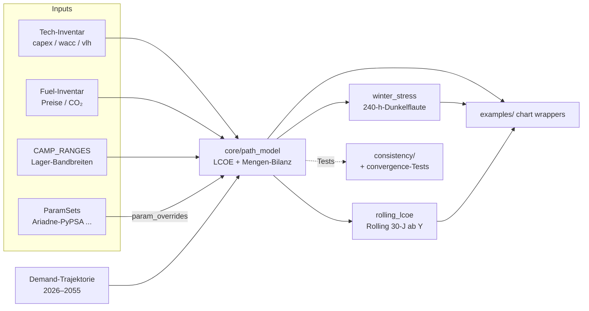

# Modell-Architektur

**Zweck.** Architektur-Referenz für enesys. Beschreibt die Schichten, Pfade und Architektur-Entscheidungen, die dem Code zugrunde liegen.

> **Robustheits-Aussagen des Modells.** Sechs zentrale
> Robustheits-Aussagen tragen das Modell: Forward-Cost-Korridor,
> Lager-Asymmetrie der Reue (EE vs. KKW), CO₂-Bridge-Mehremissionen,
> Frist-Härte und KKW-Bauzeit-Empirie, Risiko-/Versicherungs-Logik,
> Multikriterien-Ranking. Sie sind im Code
> (`core/sensitivity.py`, `core/regret_decision_tree.py`,
> `extensions/multicriteria.py`) und in den Tests (`tests/consistency/`)
> operationalisiert.

## Inhaltsverzeichnis

**Teil A — Architektur**

- [A.0 Architektur-Prinzipien](#a0-architektur-prinzipien)
- [A.1 Drei-Schichten-Architektur](#a1-drei-schichten-architektur)
- [A.2 Sechs-Pfade-Architektur](#a2-sechs-pfade-architektur)
- [A.3 Mengen-Architektur (LCOE-Schicht)](#a3-mengen-architektur-lcoe-schicht)
- [A.4 Coverage-Architektur (Stresstest-Schicht)](#a4-coverage-architektur-stresstest-schicht)
- [A.5 Lager-Bandbreiten als Sensitivitäts-Quelle](#a5-lager-bandbreiten-als-sensitivitats-quelle)
- [A.6 Versorgungs-Schwelle und Doppel-Filter-Methodik](#a6-versorgungs-schwelle-und-doppel-filter-methodik)
- [A.7 Definitorische Pfad-Kalibrierung](#a7-definitorische-pfad-kalibrierung)
- [A.8 Code-Modul-Mapping](#a8-code-modul-mapping)
- [A.10 Sensitivität: Tornado und Monte-Carlo](#a10-sensitivitat-tornado-und-monte-carlo)
- [A.11 Architektur-Entscheidungen mit Begründung](#a11-architektur-entscheidungen-mit-begrundung)
- [A.12 Methodische Entscheidungen mit Begründung](#a12-methodische-entscheidungen-mit-begrundung)

---

# Teil A — Architektur

## A.0 Architektur-Prinzipien

1. **Lose Kopplung zwischen Schichten.** Die Modell-Schichten (Demand, LCOE/Mengen-Bilanz, Stresstest, Steady State) haben disjunkte Verantwortlichkeiten und kommunizieren über klar definierte Interfaces (Pfad-Definition, Lager-Zugehörigkeit). Direkte GW→TWh-Transformationen quer durch die Schichten werden vermieden.

2. **Eine Single-Source-of-Truth pro Konzept.** Lager-Bandbreiten in `CAMP_RANGES`, Quellen-Tags in `docs/SOURCES.md`, Inventar-Werte in `core/inventories/`. Drift wird durch Architektur-Tests und Source-Trace-Pflicht maschinell verhindert.

3. **Pragma vor Eleganz.** Methodisch saubere Erweiterungen werden zurückgestellt, wenn sie das Komplexitäts-Budget sprengen würden. Die zentralen Robustheits-Aussagen tragen ohne sie.

4. **Definitorische Pfad-Setzung statt Modell-Ableitung.** Die programmatischen Pfade sind kalibriert, nicht modelliert. Das hält die Modell-Komplexität niedrig und macht die Argumentation klarer.

---

## A.1 Drei-Schichten-Architektur

Das Modell trennt vier methodische Schichten, die je eine eigene Frage beantworten:

| Schicht | Frage | Modell-Einheit | Zeitauflösung | Code-Heimat |
|---|---|---|---|---|
| **Demand** | Wie viel Strom wird wann gebraucht? | TWh/a, GW peak | jahresgemittelt + Winter-Spitze | `core/demand.py` (aggregierte Schicht) + `core/inventories/demand_curves.py` (Pfad-Trajektorien) |
| **LCOE / Mengen-Bilanz** | Was kostet der Pfad 2026–2055 pro kWh? | ct/kWh, gemittelt | Jahres-Trajektorie | `core/path_model.py` |
| **Stresstest** | Reicht die installierte Leistung in der Spitzenstunde? | GW peak | 240-h-Dunkelflaute | `extensions/winter_stress.py` |
| **Steady State** | Was kostet der Pfad nach Klimaneutralität pro kWh? | ct/kWh | Rolling 30-J ab Start-Jahr | `core/rolling_lcoe.py` (`rolling_lcoe(year=2055)`) |

**Steady State als Plausibilitäts-Check.** Hauptmetrik ist der kanonische Rolling-30-Jahres-LCOE ab Investment-Start-Jahr (Default 2026). Die Steady-State-Lesart ist derselbe Rolling-Mechanismus mit Start-Jahr 2055 — sie hebt sich dort zur eigenständigen Aussage, wo die Doppel-Filter-Methodik (siehe A.6) sie als zweite Modell-Frage braucht.

**Daten- und Aufruf-Fluss zwischen den Schichten:**



Pfeile: durchgezogen = Daten-/Funktions-Fluss, gestrichelt = Test-Verifikation.

---

## A.2 Sechs-Pfade-Architektur

Sechs alternative politische Szenarien als Vergleichs-Punkte. **Die Pfade sind alternative Szenarien, nicht parallele Welten** — in jedem Szenario existiert nur einer der sechs Pfade.

| Pfad | Lager | Charakter | Backup-Architektur |
|---|---|---|---|
| WEITER-SO | Status-quo | gebremster EE-Ausbau, Erdgas dauerhaft | klassisches Erdgas + Kohle bis 2038 |
| BESTAND | Bestands-Lager | aktives Erdgas-Programm, kein KKW | Erdgas-Bestand + Neubau, KVBG-Kohle bis 2038 |
| EE-GAS | EE-Lager | 92 % EE + 8 % Erdgas-Bridge | Erdgas-Bestand + H2-ready (auf Gas) |
| EE-H2 | EE-Lager | 92 % EE + 8 % H2-Backup | Erdgas-Bestand + H2-ready (auf H2 ab Verfügbarkeit) |
| KKW-GAS | KKW-Lager | 30 % KKW + 59 % EE + 11 % Erdgas | KKW-Grundlast + Erdgas-Bridge |
| KKW-H2 | KKW-Lager | dito mit H2-Backup | KKW + H2-Bridge |

**Pfad-Symmetrien:**

- EE-GAS und EE-H2: identischer EE-Mix (40/30/15/4/3 %), unterschiedliches Backup
- KKW-GAS und KKW-H2: identischer EE-Anteil (59 %) + Bridge-Backup
- BESTAND ohne GAS/H2-Aufspaltung (Bestands-Lager-Programm ist auf Erdgas fixiert)

**Lager-Mapping (Schicht 1–2 der Lager-Architektur):**

| Lager | Pfade | Referenz-Pfad |
|---|---|---|
| Bestands-Lager | BESTAND | WEITER-SO ist Bestands-ohne-Programm-Erfolg |
| EE-Lager | EE-GAS, EE-H2 | — |
| KKW-Lager | KKW-GAS, KKW-H2 | — |

WEITER-SO dient als Referenz-Pfad — er beschreibt, was *passiert*, wenn keines der Lager sein politisches Programm umsetzt. Diese Referenz-Beziehung gilt für alle aktiven Pfade symmetrisch.

---

## A.3 Mengen-Architektur (LCOE-Schicht)

Das Modell rechnet eine dynamische Mengen-Bilanz pro Pfad-Jahr-Lager-Kombination und aggregiert sie über ein Rolling-Fenster zum kanonischen LCOE.

**Mengen-Bilanz pro Jahr** (`compute_path()` in `core/path_model.py`). Pro Jahr läuft Merit-Order über `path_policy.dispatch_priority`, brennstoff-gebunden durch `fuel_set` + Brennstoff-Caps. Mengen entstehen dynamisch aus Politik (`PolitikSetzung`-Default pro Pfad) × Lager-Belief × Brennstoff-Verfügbarkeit.

**Rolling-LCOE** (`rolling_lcoe()` in `core/rolling_lcoe.py`). Aggregiert die jährlichen LCOE-Werte über ein 30-Jahres-Fenster ab beliebigem Start-Jahr — Default 2026 (Pfad-Lebenszyklus), `rolling_lcoe(2055)` als Steady-State-Lesart. Ein fließender Übergang vom Bridge-Pfad in den Steady-State ohne Stützstellen-Diskussion. Pfad-Mix-Aussagen werden parallel aus `PathResult.mix_by_technology` über `core/path_aggregations.py` aggregiert (`snapshot_mix`, `mean_mix`, `steady_state_mix`).

Die Mengen-Anteile pro Pfad sind nicht hartcodiert — sie ergeben sich aus dem Merit-Order-Dispatch:

```
EE-GAS / EE-H2:
  PV 40 % + Wind onshore 30 % + Wind offshore 15 %
  + Biomasse 4 % + Hydro 3 % + Backup 8 % = 100 %

KKW-GAS / KKW-H2:
  PV 25 % + Wind onshore 18 % + Wind offshore 10 %
  + Biomasse 3 % + Hydro 3 % + (KKW + Bridge) 35 % + H2-Sekundär 6 % = 100 %

BESTAND: EE-Anteil + Erdgas-Anteil dynamisch (16 % → 50 % bis 2055)
WEITER-SO: gebremster EE-Mix × ee_share_weiterso + Kohle + Gas + Importe
```

**Methodischer Status:**

1. **Die Mix-Anteile sind politische Setzung im Code**, keine ökonomische Optimierung. Insbesondere ist die 8 %-Backup-Quote in EE-Pfaden ein Programm-Commitment des EE-Lagers (in `PolitikSetzung` und `dispatch_priority` verankert), nicht das Modell-Ergebnis einer Kostenminimierung.

2. **Die Mengen-Bilanz ist Politik-konsistent.**
   `nep_realization_rate`, `nuclear_realization_rate` und
   `h2_realization_rate` (in `PolitikSetzung`) skalieren die installierte
   Tech-Kapazität pro Jahr; weniger Kapazität → weniger Dispatch →
   mehr Brennstoff-Backup → höhere LCOE auf dem betroffenen Pfad. Die
   effektive Realisierung läuft durch den **Min-Operator** mit dem
   Lager-Welt-Belief (`CAMP_NEP_WORLD_BELIEF` etc. in
   `core/realization_belief.py`): die pessimistischere der beiden
   Setzungen — Politik-Wunsch vs. Welt-Belief des Lagers — wirkt. Damit
   drosselt ein NEP-skeptisches Lager die EE-Politik auch in EE-Pfaden.

3. **WEITER-SO und BESTAND haben strukturell deutlich mehr Backup.** WEITER-SO durchgehend ~50 %, BESTAND wachsend von 26 % auf 60 %. Die Asymmetrie zwischen aktiven Pfaden (8 %) und den fossil-dominanten Referenz-/Bestands-Pfaden (>50 %) ist Teil der Pfad-Definition (siehe A.7).

---

## A.4 Coverage-Architektur (Stresstest-Schicht)

Pro Pfad eine Coverage-Kaskade mit asymmetrischer Logik (`extensions/winter_stress.py`):

```
EE-GAS (Beispiel):
  Batterien (gemittelt)         = bat_avg_ee_gas             (Cap-direkt)
  Gas-Backup                    = min(cap, residual - bat)   (Kaskade)
  Importe                       = min(8 GW, residual - bat - gas)  (Kaskade)
  Biomasse-Flex                 = 5,0 GW                     (additiv, immer)
  DSM                           = min(15,0, residual × 0,10) (unabhängig)
```

Die Coverage rechnet für den Stresstest, was im Worst-Case zur Verfügung steht — nicht das ökonomische Optimum. Diese Unterscheidung gegen die LCOE-Schicht ist bewusst (lose Kopplung nach A.0): der Stresstest darf zusätzliche Reserven ziehen, die im LCOE-Mittel nicht honoriert werden.

---

## A.5 Lager-Bandbreiten als Sensitivitäts-Quelle

`core/camp_ranges.py` enthält die zentrale Lager-Bandbreitentabelle `CAMP_RANGES` mit **fünf Lager-Spalten:** `neutral_default`, `ee_optimistic`, `atom_optimistic`, `bestand_optimistic`, `weiterso_optimistic`. Das Bestand-Lager ist eine eigene Position, nicht identisch mit dem KKW-Lager.

**Wahrheit:** `src/enesys/core/camp_ranges.py` ist die Single Source — Quellen-Tags pro Parameter, Verteilungs-Annahme pro Hebel, vollständige Liste aller Parameter. Architektur-Tests im Pfad `tests/architecture/` prüfen Naming-Konvention und Vollständigkeit.

**Größenordnung der Spreizung (illustrativ — aktuelle Werte sind im Code, nicht hier):**

| Parameter-Klasse | Typische Spreizung |
|---|---|
| `pv_lcoe` (PV-Stromgestehungskosten ct/kWh) | EE-Lager unter Lit-Untergrenze, KKW-Lager über Lit-Obergrenze |
| `nuclear_lcoe` (KKW-Stromgestehungskosten ct/kWh) | EE-Lager an HPC-/Flamanville-Realität, KKW-Lager an Plan-LCOE neuer EPR |
| `co2_price_eur_t_2030` | Bestands-Lager niedrig, EE-Lager hoch (»aggressivere Klimapolitik«) |
| `nuclear_full_load_hours` | EE-Lager niedriger (EE-System drosselt KKW), Atom-Lager privilegiert |

**Naming-Konvention für Parameter:** sprechende Suffixe (`_lcoe`, `_lcos`, `_full_load_hours`, `_eur_t` mit Jahres-Anker, `_capex_eur_kw`, `_opex_eur_kw_year`, `_lifetime`, `_vlh`, `_share`, `_gw` / `_twh`). Bestehende Code-Namen werden nicht rückwirkend umbenannt; ein Architektur-Test prüft, dass neue Parameter die Konvention einhalten.

Diese Tabelle treibt die Tornado-Sensitivität und die Monte-Carlo-Robustheit (siehe A.10).

---

## A.6 Versorgungs-Schwelle und Doppel-Filter-Methodik

Die Lager-Programme tragen unterschiedliche Defizit-Toleranzen (Schicht 3 der Lager-Architektur):

| Lager | Akzeptable Defizit-Schwelle | Begründung |
|---|---|---|
| Bestands-Lager | 0–5 GW | „kein Industrie-Lastabwurf, Standortsicherheit" |
| Neutrale Mitte (Default) | 10–15 GW | ERAA + BNetzA + politisch verteilbares DSM |
| EE-Lager | 15–25 GW | „DSM ist Teil der Energiewende" |
| KKW-Lager | 5–10 GW | „Atom als Grundlast, kein DSM-Vertrauen" |

**Doppel-Filter-Methodik.** Realistische Pfade müssen zwei Filter passieren:

1. **Versorgungssicherheits-Filter:** LOLE max. 3 h/Jahr (ENTSO-E ERAA), Reservemarge ≥ 5 % über Spitzenlast.
2. **Stranded-Assets-Filter:** Investitionen müssen zum Steady State beitragen, nicht reine Bridge sein.

Beide Filter zusammen schließen WEITER-SO methodisch aus — er scheitert an beiden.

---

## A.7 Definitorische Pfad-Kalibrierung

Die **fünf programmatischen Pfade** (BESTAND, EE-GAS, EE-H2, KKW-GAS, KKW-H2) sind so kalibriert, dass sie ihre Versorgungs-Anforderung in der Bridge-Phase erfüllen. **Das ist Pfad-Definition, keine Modell-Ableitung.** Was sich pfad-spezifisch unterscheidet, sind die Forward-Cost-Bilanz und die CO₂-Bilanz. WEITER-SO ist der einzige Pfad, dessen Backup-Architektur strukturell nicht ausreicht — auch das ist eine politische Setzung, kein Modell-Ergebnis.

BESTAND ist insofern *besonders*, weil es ein Bestands-Lager-Pure-Play ist — politisch *gewollte* Erdgas-Strategie, nicht passive Drift. Damit gehört BESTAND methodisch zu den aktiv-kalibrierten Pfaden, nicht zu WEITER-SO.

Diese definitorische Setzung stellt sicher, dass alle programmatischen Pfade die Versorgungssicherheit leisten können. Die Bewertung verlagert sich damit von „Wer hält den Stresstest?" auf „Was kostet ein Pfad, und wieviel CO₂ spart er?".

**Backup-Asymmetrie als Pfad-Definition:**

- EE-GAS, EE-H2: fixe 8 % Backup (Lager-Programm investiert aktiv in Reduktion)
- KKW-GAS, KKW-H2: 5–15 % dynamisch (KKW-Grundlast übernimmt einen Teil)
- BESTAND: 26–60 % wachsend (Lager-Programm gewollt fossil-dominant, aber kontrolliert)
- WEITER-SO: ~50 % dauerhaft (Referenzfall: keine aktive Lager-Politik, Bestand bleibt aus Trägheit)

---

## A.8 Code-Modul-Mapping

| Modul | Funktion |
|---|---|
| `core/demand.py` | Aggregierte Demand-Schicht (Sektorkopplung Mobilität / Wärme / Industrie / Sockel) |
| `core/inventories/demand_curves.py` | Strom-Bedarfs-Trajektorien pro Pfad |
| `core/inventories/tech_inventory.py` | Erzeugungstechnologien (Bestand, Zubau, CAPEX, WACC, …) |
| `core/inventories/fuel_inventory.py` | Mengenbegrenzte Brennstoffe (Dauer-/Boost-Mengen, Preis, CO₂) |
| `core/inventories/path_policy.py` | Pfad-Politik (Dispatch-Reihenfolge, Constraints, Politik-Default) |
| `core/path_model.py` | Mengen-Bilanz-Pipeline: Kapazitäts-Aufbau, Dispatch, LCOE-Komposition, Tornado + Monte-Carlo |
| `core/path_sensitivity.py` | Snapshot-LCOE für Lager-Presets und Schadens-Asymmetrie |
| `core/path_inputs.py` | Param-Dataclasses für externe Konsumenten (Demand, ForwardCost, TimePath, …) |
| `core/camp_ranges.py` | `CAMP_RANGES` als zentrale Bandbreiten-Tabelle |
| `core/regret_decision_tree.py` | Reue-Matrix nach Savage-Minimax-Regret |
| `core/system_state.py` | NORMAL / SCARCITY / DUNKELFLAUTE-State-Modell für Dispatch |
| `core/wacc.py` | WACC-Helfer pro Technologie |
| `core/source_trace.py` | CI-Tool für Quellen-Tag-Konsistenz |
| `extensions/winter_stress.py` | 240-h-Dunkelflaute-Stresstest |
| `extensions/landuse.py` | Flächenbedarfs-Rechnung |
| `extensions/multicriteria.py` | Multikriterien-Bewertung pro Lager-Profil |
| `extensions/profile_costs.py` | Profile-Cost-Sensi-Achse |
| `extensions/consumers.py` | Verbraucher-Sicht (Strompreis-Aufschläge) |

**Modul-Architektur-Prinzip:** `core/` enthält den für alle Pfade gemeinsamen Kern, `extensions/` enthält ergänzende Analysen (eigenständig nutzbar, optionale Erweiterungen).

---

## A.10 Sensitivität: Tornado und Monte-Carlo

Die Sensitivitäts-Analyse ist die zentrale Methodik für die
Robustheits-Aussagen zu Frist-Härte und Risiko-/Versicherungs-Logik.
Sie sitzt in `core/sensitivity.py`
(Baseline, Tornado, Monte-Carlo über strukturelle Hebel) und in
`core/path_sensitivity.py` (Snapshot-Datenstrukturen für Lager-Presets)
und nutzt die `CAMP_RANGES` aus A.5 als Eingabe.

### A.10.1 Tornado-Analyse

`tornado_path_analysis(path, ...)` rechnet pro Pfad und pro Lager-Parameter:

- LCOE bei Parameter auf Low-Wert (alle anderen auf neutral)
- LCOE bei Parameter auf High-Wert (alle anderen auf neutral)
- Differenz = Sensitivität dieses Parameters für diesen Pfad

Ausgabe: pro Pfad eine sortierte Liste der Top-Hebel mit ihrer LCOE-Wirkung in ct/kWh. Dient als Input für die Top-Hebel-Tabelle und für die Sensitivitätsanalyse („Welche Parameter dominieren den Pfad-LCOE?").

### A.10.2 Monte-Carlo-Analyse

`monte_carlo_all_paths(n_runs=3000, seed=42)` rechnet:

- 3.000 Sample-Läufe (Default)
- pro Lauf: alle Tornado-Hebel uniform aus ihren Bandbreiten ziehen, alle sechs Pfade auswerten
- Output: P(EE-GAS < anderer Pfad) pro Vergleich, Ranking-Verteilung, Top-2-Wahrscheinlichkeit für EE-GAS

### A.10.3 Stärken und Grenzen

**Stärken:** Bandbreiten-basiert statt Worst/Best-Case; reproduzierbar (seed=42); liefert Verteilungen statt Punkt-Schätzer (3.000 Läufe).

**Grenzen:** Verteilungsannahmen sind Lager-symmetrisch (Uniform über die Lager-Bandbreite), nicht empirisch validiert; kein Tail-Risk-Modell für Black-Swan-Ereignisse; Strukturparameter (Strombedarf-Niveau, Demand-Trajektorie) sind nicht im MC.

---

## A.11 Architektur-Entscheidungen mit Begründung

Konsolidierung der Strategie-Entscheidungen, die der Architektur zugrunde liegen. Vor jeder strukturellen Änderung lesen, um den Designintent nicht zu verletzen.

### A.11.1 Trennung Inventare ↔ Pipeline

Modell-Logik ist auf zwei Schichten getrennt: `core/inventories/` (deklarative Tabellen für Tech, Brennstoff, Pfad-Politik, Demand) und `core/path_model.py` (operative Pipeline, die aus den Inventaren die Mengen-Bilanz und den LCOE ableitet).

**Begründung:** Trennung nach Verantwortlichkeit. Inventare sind Stammdaten mit Source-Tags; die Pipeline ist Mechanik, die nur über die deklarierten Inventar-Werte rechnet. Refactor-Sicherheit: Pipeline-Änderungen können die Inventar-Werte nicht versehentlich verschieben.

### A.11.2 Forward Cost only — keine Sunk Costs in LCOE

Alle LCOE-Rechnungen verwenden Forward-CAPEX (heute zu investieren), nicht historische CAPEX (was Bestand gekostet hat).

**Begründung:** Sunk Costs sind entscheidungstheoretisch irrelevant für neue Investitionen. Vermischung verwechselt gesellschaftliche Buchhaltung mit Marginal-Entscheidungs-Ökonomie. Das Modell setzt die Trennung durch.

### A.11.3 Zeit als First-Class-Variable

Die Pipeline integriert von 2026 bis 2055, nicht nur bis 2045.

**Begründung:** KKW-Pfade liefern unter realistischen Bauzeiten erst
zwischen 2036 (atom_optimistic) und 2050 (ee_optimistic) — der Vergleich
„Steady State 2045" verlöre 10–24 Jahre Bridge-Gas-Emissionen. Das
30-Jahres-Fenster erfasst den vollen Übergang einschließlich der
Post-KKW-Startup-Jahre.

**Implikation:** Kumulierte CO₂-Differenzen werden sichtbar. Der
Bridge-Gas-Effekt ist die zentrale strukturelle CO₂-Asymmetrie.

### A.11.4 Asymmetrische Flexibilität pro Pfad

Jeder Pfad hat pfad-spezifische Werte für DSM, V2G und Wärmepumpen-Anteile, mit zugehörigen Kostenrabatten und Investitionen.

**Begründung:** EE-Pfade brauchen mehr Flexibilitäts-Investition als KKW-Pfade (Grundlast-Effekt). Ein globaler Parameter würde EE-Pfade benachteiligen oder KKW unfair gutschreiben.

### A.11.5 Open Source — MIT (Code) + CC-BY-4.0 (Doku)

**Begründung:** MIT erlaubt Forks für andere regulatorische Kontexte (FR, PL, UK) und kommerzielle Nutzung (Berater, Investoren) ohne Reibung. CC-BY für die Doku erlaubt Wiederverwendung in Begleitliteratur ohne Lizenz-Konflikt.

### A.11.6 KKW-Hochlauf-Annahme: 24 GW agnostisch zur Reaktor-Aufteilung

**Setzung.** Im Modell ist die KKW-Zielkapazität als `nuclear_target_gw_2050 = 24,0 GW` gesetzt. Die Aufteilung in Reaktor-Anzahl und -Klasse ist nicht parametrisiert — das Modell ist agnostisch zwischen 6×4 GW (EPR2-Klasse), 12×2 GW (SMR) und Mischformen.

**Begründung.** Die LCOE-Modellierung über `nuclear_capex_eur_kw = 11.000` ist Mittelwert für 4-GW-Klassen-Reaktoren (Hinkley/Flamanville-Niveau). Reaktor-Anzahl-Annahmen würden eine Industrie-Politik-Wette modellieren, die im Kerntext bewusst offen bleibt; Sensi-Engagement gehört zu den Lager-Bandbreiten in `CAMP_RANGES`, nicht zur Default-Modellierung.

**Reaktor-Tempo-Implikation.** Bei sechs Reaktoren à 4 GW im Hochlauf
ab Lager-IBN (2036 atom_optimistic, 2046 neutral_default, 2050
ee_optimistic) bis 2050 ergibt sich ein Inbetriebnahme-Tempo zwischen
einem Reaktor pro 2,3 Jahre (atom_opt) und nur Einzel-Reaktoren bis 2055
(ee_opt). Frankreich hat in seiner Aufbauphase 1980–1990 etwa einen
Reaktor pro Jahr erreicht — das deutsche Tempo wäre selbst im
atom_optimistic-Lager halb so schnell. Bei 12 SMR über acht Jahre wäre
das Tempo handhabbarer (ein SMR pro 0,67 Jahre); die Risiken liegen
dann in der industriellen Lieferketten-Reife für serielle Module.

**Replacement-Logik.** Reaktor-Lifetime 60 Jahre. Erste Reaktoren
müssten je nach Lager-IBN frühestens 2096+ ersetzt werden — außerhalb
des Modell-Horizonts 2055. Steady-State 2055 nimmt an, dass die
hochgelaufene Flotte zwischen 2050 und 2055 unverändert läuft.

### A.11.7 Asynchrone Pfad-Fertigstellung im Steady-State-Fenster

**Setzung.** Markt-Parameter (Brennstoff-Preise, CO₂-Preise,
Mengen-Kapazitäten) sind im Modell jahresunabhängig oder plateauen
spätestens 2055 — Camp-Belief-Spreizung statt linearer Extrapolation.
Politik-Trajektorien (KKW-Neubau-Hochlauf, Sektor-Kopplungs-Demand)
laufen dagegen weiter, bis das jeweilige Pfad-Ziel realisiert ist; im
neutralen Lager erreicht der KKW-Pfad sein 24-GW-Ziel erst in den
späten 2060ern (Bauzeit-sqrt-Streckung).

**Implikation für Rolling-LCOE.** Im Fenster ab 2055 trägt die
verbleibende LCOE-Dynamik ausschließlich die asynchrone Pfad-
Fertigstellung: in KKW-Pfaden wird Bridge-Gas durch späte Reaktor-
Inbetriebnahmen abgelöst, die Rolling-LCOE-Drift macht diesen Zeit-
Versatz politischer Programme sichtbar. Strikte Monotonie der Rolling-
Konvergenz ist deshalb konzeptionell nicht erwartbar — eine Pfad-
Politik stoppt nicht, nur weil ein Steady-State-Fenster startet.
Operationale Schranke (getestet in
`tests/core/test_rolling_lcoe.py:test_rolling_lcoe_asymptotic_policy_completion`):
`|rolling(2055) − rolling(2070)| < 1 ct/kWh` für alle aktiven Pfade.

---

## A.12 Methodische Entscheidungen mit Begründung

### A.12.1 Source-Trace als CI-Pflicht

Jeder Default-Parameter trägt einen `[SRC: TAG]`- oder `[CALIBRATED]`-Kommentar. Tags resolvieren in `docs/SOURCES.md` mit Zitat, URL, Datum. CI scheitert sonst.

**Begründung:** Ohne Erzwingung degradiert Quellen-Disziplin nach Monaten. CI-Compute-Zeit (~5 s) ist trivial; die erhaltene Disziplin ist projekt-essenziell.

### A.12.2 Lager-Presets als adversarielle Sets

Vier Lager: EE-optimistisch, neutrale Mitte, Bestand-optimistisch, Atom-optimistisch.

**Begründung:** Robustheits-Aussagen sind nur belastbar, wenn sie *adversarielle* Parameter überleben. Ein Lauf mit EE-Lager-Werten ist nicht „EE-freundlich verzerrt", sondern „wie sieht die Analyse unter den EE-günstigsten Annahmen aus". Wenn KKW-Pfade unter EE-Lager-Annahmen verlieren UND unter Atom-Lager-Annahmen verlieren, ist das ein robustes Ergebnis.

### A.12.3 Verteilungen für Monte-Carlo

Uniform-Verteilung über die Lager-Bandbreite, ohne Korrelationen. Das ist die konservative Default-Wahl: breite Spannweite, weniger Häufung am Mittel. Korrelationen lassen sich nachträglich ergänzen, wenn ein methodischer Bedarf belegt ist.

**Begründung.** Reale KKW-Kostenüberschreitungen sind asymmetrisch (Hinkley 2× Budget, Flamanville 4× — kein KKW-Projekt 4× *unter* Budget). Lognormal-Verteilungen würden das schärfer erfassen, kosten aber zusätzliche Annahmen über die Verteilungs-Parameter. Bis dahin bleibt die robuste Default-Wahl Uniform mit dokumentierter Bandbreite.

### A.12.4 Sektorkopplung als Primärenergie-Hebel

Das Modell trackt explizit den Primärenergie-Effizienzgewinn aus EVs und Wärmepumpen. Der 2:1-Hebel (1 TWh zusätzlicher Strom ersetzt 2 TWh fossile End-Energie) wird gerechnet und in der UI sichtbar gemacht.

**Begründung:** Die öffentliche Debatte rahmt Sektorkopplung als „mehr Strombedarf = mehr Risiko". Diese Rahmung ist unvollständig: derselbe Strombedarf ersetzt mehr fossile Energie, als er an EE-Erzeugung verlangt. Ohne Explizit-Machen verlöre das Modell eine seiner stärksten Einsichten.

### A.12.5 Winter-Stresstest kalibriert, nicht erfunden

Die Winter-Spitzenlast-Formel ist gegen die BNetzA-2045-Bandbreite (130–160 GW für vollelektrifiziertes Szenario) kalibriert.

**Begründung:** Nach Kalibrierung gegen ÜNB-Szenarien (Heizungs-Multiplikator 1,8×) liefert die Formel 119 GW für Default-Elektrifizierung und steigt Richtung 145 GW für Voll-Elektrifizierung. Empirischer Anker: Dezember-2024-Dunkelflaute (264 h, längste seit 1982).
