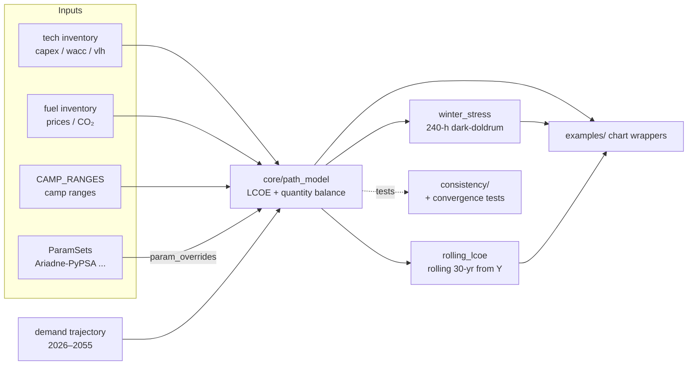

# Model architecture

**Purpose.** Architecture reference for enesys. Describes the layers,
paths, and architectural decisions underlying the code.

> **The model's robustness claims.** Six central robustness claims
> carry the model: the forward-cost corridor, the camp asymmetry of
> regret (EE vs. KKW), CO₂ bridge-phase extra-emissions, deadline
> rigor and the KKW build-time evidence, the risk/insurance logic,
> and the multi-criteria ranking. They are operationalized in code
> (`core/sensitivity.py`, `core/regret_decision_tree.py`,
> `extensions/multicriteria.py`) and in the tests
> (`tests/consistency/`).

## Table of contents

**Part A — Architecture**

- [A.0 Architectural principles](#a0-architectural-principles)
- [A.1 Three-layer architecture](#a1-three-layer-architecture)
- [A.2 Six-path architecture](#a2-six-path-architecture)
- [A.3 Quantity architecture (LCOE layer)](#a3-quantity-architecture-lcoe-layer)
- [A.4 Coverage architecture (stress-test layer)](#a4-coverage-architecture-stress-test-layer)
- [A.5 Camp ranges as a sensitivity source](#a5-camp-ranges-as-a-sensitivity-source)
- [A.6 Supply threshold and double-filter methodology](#a6-supply-threshold-and-double-filter-methodology)
- [A.7 Definitional path calibration](#a7-definitional-path-calibration)
- [A.8 Code-module mapping](#a8-code-module-mapping)
- [A.10 Sensitivity: tornado and Monte Carlo](#a10-sensitivity-tornado-and-monte-carlo)
- [A.11 Architectural decisions with rationale](#a11-architectural-decisions-with-rationale)
- [A.12 Methodological decisions with rationale](#a12-methodological-decisions-with-rationale)

---

# Part A — Architecture

## A.0 Architectural principles

1. **Loose coupling between layers.** The model layers (demand,
   LCOE/quantity balance, stress test, steady state) have disjoint
   responsibilities and communicate through well-defined interfaces
   (path definition, camp affiliation). Direct GW→TWh transformations
   that cut across layers are avoided.

2. **One single source of truth per concept.** Camp ranges in
   `CAMP_RANGES`, source tags in `docs/SOURCES.md`, inventory values in
   `core/inventories/`. Drift is prevented mechanically by architecture
   tests and a source-trace obligation.

3. **Pragma before elegance.** Methodologically clean extensions are
   deferred when they would blow the complexity budget. The central
   robustness claims carry without them.

4. **Definitional path setting instead of model derivation.** The
   programmatic paths are calibrated, not modeled. That keeps model
   complexity low and the argument clearer.

---

## A.1 Three-layer architecture

The model separates four methodological layers, each answering its own
question:

| Layer | Question | Model unit | Time resolution | Code home |
|---|---|---|---|---|
| **Demand** | How much electricity is needed, when? | TWh/yr, GW peak | annual-mean + winter peak | `core/demand.py` (aggregate layer) + `core/inventories/demand_curves.py` (path trajectories) |
| **LCOE / quantity balance** | What does the path cost per kWh 2026–2055? | ct/kWh, averaged | annual trajectory | `core/path_model.py` |
| **Stress test** | Is the installed capacity enough in the peak hour? | GW peak | 240-h dark-doldrum | `extensions/winter_stress.py` |
| **Steady state** | What does the path cost per kWh after climate neutrality? | ct/kWh | rolling 30-yr from start year | `core/rolling_lcoe.py` (`rolling_lcoe(year=2055)`) |

**Steady state as a plausibility check.** The main metric is the
canonical rolling-30-year LCOE from the investment start year (default
2026). The steady-state reading is the same rolling mechanism with
start year 2055 — it becomes a standalone claim where the
double-filter methodology (see A.6) requires it as a second model
question.

**Data and call flow between layers:**


```mermaid
flowchart LR
    subgraph Inputs
      Tech[tech inventory<br/>capex / wacc / vlh]
      Fuel[fuel inventory<br/>prices / CO₂]
      Camp[CAMP_RANGES<br/>camp ranges]
      ParamSet[ParamSets<br/>Ariadne-PyPSA ...]
    end

    Tech --> LCOE
    Fuel --> LCOE
    Camp --> LCOE
    ParamSet -->|param_overrides| LCOE

    Demand[demand trajectory<br/>2026–2055] --> LCOE

    LCOE[core/path_model<br/>LCOE + quantity balance] --> Stress
    LCOE --> SteadyState
    LCOE --> UI

    Stress[winter_stress<br/>240-h dark-doldrum] --> UI
    SteadyState[rolling_lcoe<br/>rolling 30-yr from Y] --> UI

    UI[examples/ chart wrappers]
    LCOE -.tests.-> Tests[consistency/<br/>+ convergence tests]
```

Arrows: solid = data / function flow, dashed = test verification.

---

## A.2 Six-path architecture

Six alternative political scenarios serve as comparison points. **The
paths are alternative scenarios, not parallel worlds** — in each
scenario only one of the six paths exists.

| Path | Camp | Character | Backup architecture |
|---|---|---|---|
| WEITER-SO | status-quo | dampened EE expansion, gas indefinitely | classic natural gas + coal until 2038 |
| BESTAND | existing-fleet camp | active gas program, no nuclear | existing gas + new build, KVBG coal until 2038 |
| EE-GAS | EE camp | 92 % EE + 8 % gas bridge | existing gas + H2-ready (on gas) |
| EE-H2 | EE camp | 92 % EE + 8 % H2 backup | existing gas + H2-ready (on H2 once available) |
| KKW-GAS | KKW camp | 30 % nuclear + 59 % EE + 11 % gas | nuclear baseload + gas bridge |
| KKW-H2 | KKW camp | as above with H2 backup | nuclear + H2 bridge |

**Path symmetries:**

- EE-GAS and EE-H2: identical EE mix (40/30/15/4/3 %), different backup
- KKW-GAS and KKW-H2: identical EE share (59 %) + bridge backup
- BESTAND has no GAS/H2 split (the existing-fleet camp program is
  fixed on natural gas)

**Camp mapping (layers 1–2 of the camp architecture):**

| Camp | Paths | Reference path |
|---|---|---|
| Existing-fleet camp | BESTAND | WEITER-SO is "existing fleet without programmatic success" |
| EE camp | EE-GAS, EE-H2 | — |
| KKW camp | KKW-GAS, KKW-H2 | — |

WEITER-SO serves as the reference path — it describes what *happens*
if none of the camps executes its political program. This reference
relationship holds symmetrically for all active paths.

---

## A.3 Quantity architecture (LCOE layer)

The model computes a dynamic quantity balance per path-year-camp
combination and aggregates it over a rolling window into the canonical
LCOE.

**Quantity balance per year** (`compute_path()` in
`core/path_model.py`). Each year runs a merit order via
`path_policy.dispatch_priority`, bound to fuel via `fuel_set` + fuel
caps. Quantities arise dynamically from policy
(`PolitikSetzung` default per path) × camp belief × fuel availability.

**Rolling LCOE** (`rolling_lcoe()` in `core/rolling_lcoe.py`).
Aggregates the annual LCOE values over a 30-year window from any start
year — default 2026 (path life cycle), `rolling_lcoe(2055)` as the
steady-state reading. A smooth transition from the bridge path into
steady state without a knot-point discussion. Path-mix statements are
aggregated in parallel from `PathResult.mix_by_technology` via
`core/path_aggregations.py` (`snapshot_mix`, `mean_mix`,
`steady_state_mix`).

The quantity shares per path are not hard-coded — they arise from the
merit-order dispatch:

```
EE-GAS / EE-H2:
  PV 40 % + wind onshore 30 % + wind offshore 15 %
  + biomass 4 % + hydro 3 % + backup 8 % = 100 %

KKW-GAS / KKW-H2:
  PV 25 % + wind onshore 18 % + wind offshore 10 %
  + biomass 3 % + hydro 3 % + (nuclear + bridge) 35 % + H2-secondary 6 % = 100 %

BESTAND: EE share + natural-gas share dynamic (16 % → 50 % by 2055)
WEITER-SO: dampened EE mix × ee_share_weiterso + coal + gas + imports
```

**Methodological status:**

1. **The mix shares are a political choice in code**, not an economic
   optimization. In particular, the 8 % backup quota in EE paths is a
   programmatic commitment of the EE camp (anchored in `PolitikSetzung`
   and `dispatch_priority`), not the model's cost-minimization result.

2. **The quantity balance is policy-consistent.**
   `nep_realization_rate`, `nuclear_realization_rate`, and
   `h2_realization_rate` (in `PolitikSetzung`) scale the installed tech
   capacity per year; less capacity → less dispatch → more fuel backup
   → higher LCOE on the affected path. Effective realization runs
   through the **min operator** with the camp's world belief
   (`CAMP_NEP_WORLD_BELIEF` etc. in `core/realization_belief.py`): the
   more pessimistic of the two settings — policy wish vs. camp world
   belief — wins. So a NEP-sceptical camp throttles EE policy even in
   EE paths.

3. **WEITER-SO and BESTAND have structurally much more backup.**
   WEITER-SO ~50 % throughout, BESTAND growing from 26 % to 60 %. The
   asymmetry between active paths (8 %) and the fossil-dominant
   reference / existing-fleet paths (>50 %) is part of the path
   definition (see A.7).

---

## A.4 Coverage architecture (stress-test layer)

A coverage cascade per path with asymmetric logic
(`extensions/winter_stress.py`):

```
EE-GAS (example):
  Batteries (averaged)            = bat_avg_ee_gas             (cap-direct)
  Gas backup                      = min(cap, residual - bat)   (cascade)
  Imports                         = min(8 GW, residual - bat - gas)  (cascade)
  Biomass flex                    = 5.0 GW                     (additive, always)
  DSM                             = min(15.0, residual × 0.10) (independent)
```

The coverage computes what is available in the worst case for the
stress test — not the economic optimum. The distinction from the LCOE
layer is deliberate (loose coupling per A.0): the stress test may draw
on extra reserves that are not credited in the LCOE mean.

---

## A.5 Camp ranges as a sensitivity source

`core/camp_ranges.py` contains the central camp-range table
`CAMP_RANGES` with **five camp columns:** `neutral_default`,
`ee_optimistic`, `atom_optimistic`, `bestand_optimistic`,
`weiterso_optimistic`. The existing-fleet camp is its own position —
it is not identical to the KKW camp.

**Source of truth:** `src/enesys/core/camp_ranges.py` is the single
source — source tags per parameter, distributional assumption per
lever, full list of all parameters. Architecture tests in
`tests/architecture/` check the naming convention and completeness.

**Spread order of magnitude (illustrative — current values live in the
code, not here):**

| Parameter class | Typical spread |
|---|---|
| `pv_lcoe` (PV generation cost ct/kWh) | EE camp below literature lower bound, KKW camp above literature upper bound |
| `nuclear_lcoe` (nuclear generation cost ct/kWh) | EE camp at HPC/Flamanville reality, KKW camp at planned LCOE for new EPR |
| `co2_price_eur_t_2030` | existing-fleet camp low, EE camp high (»more aggressive climate policy«) |
| `nuclear_full_load_hours` | EE camp lower (EE system throttles nuclear), atom camp privileged |

**Parameter naming convention:** descriptive suffixes (`_lcoe`,
`_lcos`, `_full_load_hours`, `_eur_t` with year anchor,
`_capex_eur_kw`, `_opex_eur_kw_year`, `_lifetime`, `_vlh`, `_share`,
`_gw` / `_twh`). Existing code names are not renamed retroactively;
an architecture test checks that new parameters follow the convention.

This table drives the tornado sensitivity and the Monte-Carlo
robustness (see A.10).

---

## A.6 Supply threshold and double-filter methodology

The camp programs carry different deficit tolerances (layer 3 of the
camp architecture):

| Camp | Acceptable deficit threshold | Rationale |
|---|---|---|
| Existing-fleet camp | 0–5 GW | "no industrial load shedding, site security" |
| Neutral middle (default) | 10–15 GW | ERAA + BNetzA + politically distributable DSM |
| EE camp | 15–25 GW | "DSM is part of the energy transition" |
| KKW camp | 5–10 GW | "nuclear as baseload, no DSM trust" |

**Double-filter methodology.** Realistic paths must pass two filters:

1. **Security-of-supply filter:** LOLE max. 3 h/year (ENTSO-E ERAA),
   reserve margin ≥ 5 % over peak load.
2. **Stranded-assets filter:** investments must contribute to steady
   state, not be pure bridge.

Both filters together exclude WEITER-SO methodologically — it fails
both.

---

## A.7 Definitional path calibration

The **five programmatic paths** (BESTAND, EE-GAS, EE-H2, KKW-GAS,
KKW-H2) are calibrated to meet their supply requirement in the bridge
phase. **This is a path definition, not a model derivation.** What
differs path-specifically is the forward-cost balance and the CO₂
balance. WEITER-SO is the only path whose backup architecture
structurally falls short — that too is a political choice, not a model
result.

BESTAND is *special* in that it is an existing-fleet-camp pure play —
a politically *wanted* gas strategy, not passive drift. Methodologically
this puts BESTAND with the actively-calibrated paths, not with
WEITER-SO.

This definitional choice ensures that all programmatic paths can
deliver security of supply. The evaluation therefore shifts from "Who
passes the stress test?" to "What does a path cost, and how much CO₂
does it save?".

**Backup asymmetry as path definition:**

- EE-GAS, EE-H2: fixed 8 % backup (camp program actively invests in
  reduction)
- KKW-GAS, KKW-H2: 5–15 % dynamic (nuclear baseload takes a share)
- BESTAND: 26–60 % growing (camp program deliberately fossil-dominant,
  but controlled)
- WEITER-SO: ~50 % indefinitely (reference case: no active camp
  policy, the existing fleet remains out of inertia)

---

## A.8 Code-module mapping

| Module | Function |
|---|---|
| `core/demand.py` | Aggregate demand layer (sector coupling: mobility / heat / industry / base load) |
| `core/inventories/demand_curves.py` | Electricity-demand trajectories per path |
| `core/inventories/tech_inventory.py` | Generation technologies (existing fleet, new build, CAPEX, WACC, …) |
| `core/inventories/fuel_inventory.py` | Quantity-capped fuels (sustained / boost volumes, price, CO₂) |
| `core/inventories/path_policy.py` | Path policy (dispatch order, constraints, policy default) |
| `core/path_model.py` | Quantity-balance pipeline: capacity build-up, dispatch, LCOE composition, tornado + Monte Carlo |
| `core/path_sensitivity.py` | Snapshot LCOE for camp presets and damage asymmetry |
| `core/path_inputs.py` | Param dataclasses for external consumers (Demand, ForwardCost, TimePath, …) |
| `core/camp_ranges.py` | `CAMP_RANGES` as the central range table |
| `core/regret_decision_tree.py` | Regret matrix using Savage min-max regret |
| `core/system_state.py` | NORMAL / SCARCITY / DUNKELFLAUTE state model for dispatch |
| `core/wacc.py` | WACC helpers per technology |
| `core/source_trace.py` | CI tool for source-tag consistency |
| `extensions/winter_stress.py` | 240-h dark-doldrum stress test |
| `extensions/landuse.py` | Land-use calculation |
| `extensions/multicriteria.py` | Multi-criteria evaluation per camp profile |
| `extensions/profile_costs.py` | Profile-cost sensitivity axis |
| `extensions/consumers.py` | Consumer view (electricity-price surcharges) |

**Module-architecture principle:** `core/` holds the kernel shared by
all paths; `extensions/` contains complementary analyses (independently
usable, optional extensions).

---

## A.10 Sensitivity: tornado and Monte Carlo

Sensitivity analysis is the central methodology for the robustness
claims on deadline rigor and the risk/insurance logic. It lives in
`core/sensitivity.py` (baseline, tornado, Monte Carlo over structural
levers) and in `core/path_sensitivity.py` (snapshot data structures
for camp presets), and uses `CAMP_RANGES` from A.5 as input.

### A.10.1 Tornado analysis

`tornado_path_analysis(path, ...)` computes, per path and per camp
parameter:

- LCOE with the parameter at its low value (all others at neutral)
- LCOE with the parameter at its high value (all others at neutral)
- Difference = sensitivity of this parameter for this path

Output: per path a sorted list of the top levers with their LCOE
impact in ct/kWh. Feeds the top-lever table and the sensitivity
analysis ("Which parameters dominate the path LCOE?").

### A.10.2 Monte-Carlo analysis

`monte_carlo_all_paths(n_runs=3000, seed=42)` computes:

- 3,000 sample runs (default)
- per run: draw all tornado levers uniformly from their ranges,
  evaluate all six paths
- output: P(EE-GAS < other path) per comparison, ranking distribution,
  Top-2 probability for EE-GAS

### A.10.3 Strengths and limits

**Strengths:** range-based instead of worst/best-case; reproducible
(`seed=42`); delivers distributions instead of point estimates (3,000
runs).

**Limits:** the distributional assumptions are camp-symmetric (uniform
over the camp range), not empirically validated; no tail-risk model
for black-swan events; structural parameters (electricity-demand
level, demand trajectory) are not in the MC.

---

## A.11 Architectural decisions with rationale

Consolidation of the strategic decisions underlying the architecture.
Read before any structural change to avoid violating the design intent.

### A.11.1 Separation of inventories ↔ pipeline

Model logic is split across two layers: `core/inventories/`
(declarative tables for tech, fuel, path policy, demand) and
`core/path_model.py` (operational pipeline that derives the quantity
balance and LCOE from the inventories).

**Rationale:** separation of concerns. Inventories are master data
with source tags; the pipeline is mechanics that only calculates with
the declared inventory values. Refactor safety: pipeline changes
cannot accidentally shift the inventory values.

### A.11.2 Forward cost only — no sunk costs in LCOE

All LCOE calculations use forward CAPEX (what must be invested today),
not historical CAPEX (what the existing fleet cost).

**Rationale:** sunk costs are irrelevant to new investment decisions
from a decision-theory standpoint. Mixing them confuses social
accounting with marginal-decision economics. The model enforces the
separation.

### A.11.3 Time as a first-class variable

The pipeline integrates from 2026 to 2055, not just to 2045.

**Rationale:** nuclear paths under realistic build times only deliver
between 2036 (atom_optimistic) and 2050 (ee_optimistic) — the
"steady state 2045" comparison would lose 10–24 years of bridge-gas
emissions. The 30-year window captures the full transition including
the post-nuclear-startup years.

**Implication:** cumulative CO₂ differences become visible. The
bridge-gas effect is the central structural CO₂ asymmetry.

### A.11.4 Asymmetric flexibility per path

Each path has path-specific values for DSM, V2G, and heat-pump shares,
together with the associated cost discounts and investments.

**Rationale:** EE paths need more flexibility investment than KKW
paths (baseload effect). A global parameter would disadvantage EE
paths or credit KKW unfairly.

### A.11.5 Open source — MIT (code) + CC-BY-4.0 (documentation)

**Rationale:** MIT enables forks for other regulatory contexts (FR,
PL, UK) and commercial use (consultants, investors) without friction.
CC-BY for the documentation allows reuse in companion literature
without license conflict.

### A.11.6 Nuclear ramp-up assumption: 24 GW agnostic to reactor split

**Choice.** In the model the nuclear target capacity is set as
`nuclear_target_gw_2050 = 24.0 GW`. The split into reactor count and
class is not parameterized — the model is agnostic between 6×4 GW
(EPR2 class), 12×2 GW (SMR), and mixed forms.

**Rationale.** The LCOE modeling via `nuclear_capex_eur_kw = 11,000`
is a mean for 4-GW-class reactors (Hinkley/Flamanville level).
Reactor-count assumptions would model an industrial-policy bet that
the core text deliberately leaves open; sensitivity engagement
belongs to the camp ranges in `CAMP_RANGES`, not the default model.

**Reactor-pace implication.** Six 4-GW reactors during ramp-up from
camp IBN (2036 atom_optimistic, 2046 neutral_default, 2050
ee_optimistic) through 2050 yields a commissioning pace between one
reactor every 2.3 years (atom_opt) and only individual reactors
through 2055 (ee_opt). During its build-up phase 1980–1990 France
achieved about one reactor per year — the German pace would be half
that even in the atom_optimistic camp. With 12 SMRs over eight years
the pace would be more manageable (one SMR every 0.67 years); the
risks then lie in industrial supply-chain maturity for serial modules.

**Replacement logic.** Reactor lifetime 60 years. Depending on camp
IBN, the first reactors would need replacement no earlier than 2096+ —
outside the model horizon of 2055. Steady state 2055 assumes the
ramped-up fleet runs unchanged between 2050 and 2055.

### A.11.7 Asynchronous path completion in the steady-state window

**Choice.** Market parameters (fuel prices, CO₂ prices, capacity
volumes) are year-independent in the model or plateau by 2055 at the
latest — camp-belief spread instead of linear extrapolation. Policy
trajectories (KKW new-build ramp-up, sector-coupling demand) keep
running until the path target is realized; in the neutral camp the
KKW path reaches its 24-GW target only in the late 2060s (sqrt
build-time stretching).

**Implication for rolling LCOE.** In the window from 2055 onward, the
remaining LCOE dynamics are carried solely by the asynchronous path
completion: in KKW paths bridge gas is replaced by late reactor
commissioning, and the rolling-LCOE drift makes this time offset of
political programs visible. Strict monotone convergence of the rolling
metric is therefore not conceptually expected — a path policy does
not stop just because a steady-state window starts. Operational bound
(tested in
`tests/core/test_rolling_lcoe.py:test_rolling_lcoe_asymptotic_policy_completion`):
`|rolling(2055) − rolling(2070)| < 1 ct/kWh` for all active paths.

---

## A.12 Methodological decisions with rationale

### A.12.1 Source-trace as a CI obligation

Every default parameter carries a `[SRC: TAG]` or `[CALIBRATED]`
comment. Tags resolve in `docs/SOURCES.md` to a citation, URL, and
date. CI fails otherwise.

**Rationale:** without enforcement, source discipline degrades within
months. The CI compute time (~5 s) is trivial; the preserved
discipline is project-essential.

### A.12.2 Camp presets as adversarial sets

Four camps: EE-optimistic, neutral middle, existing-fleet-optimistic,
atom-optimistic.

**Rationale:** robustness claims only hold up if they survive
*adversarial* parameters. A run with EE-camp values is not
"EE-friendly biased" but "what does the analysis look like under the
most EE-favorable assumptions". If KKW paths lose under EE-camp
assumptions AND under atom-camp assumptions, that is a robust result.

### A.12.3 Distributions for Monte Carlo

Uniform distribution over the camp range, without correlations. This
is the conservative default: a broad span, less clustering at the
mean. Correlations can be added later if a methodological need is
demonstrated.

**Rationale.** Real nuclear cost overruns are asymmetric (Hinkley 2×
budget, Flamanville 4× — no nuclear project came in 4× *under*
budget). Lognormal distributions would capture that more sharply but
cost extra assumptions about the distribution parameters. Until then
the robust default remains uniform with documented ranges.

### A.12.4 Sector coupling as a primary-energy lever

The model explicitly tracks the primary-energy efficiency gain from
EVs and heat pumps. The 2:1 lever (1 TWh of additional electricity
replaces 2 TWh of fossil final energy) is computed and made visible
in the UI.

**Rationale:** the public debate frames sector coupling as "more
electricity demand = more risk". That framing is incomplete: the same
electricity demand replaces more fossil energy than it demands in EE
generation. Without making this explicit the model would lose one of
its strongest insights.

### A.12.5 Winter stress test: calibrated, not invented

The winter peak-load formula is calibrated against the BNetzA-2045
range (130–160 GW for the fully-electrified scenario).

**Rationale:** after calibration against ÜNB scenarios (heating
multiplier 1.8×), the formula yields 119 GW for default
electrification and rises toward 145 GW for full electrification.
Empirical anchor: December 2024 dark-doldrum (264 h, longest since
1982).
